# Neural MCPF Allocation
### Learning the Allocation Step of Multi-Agent Path Finding

A transformer that replaces a combinatorial solver's allocation —
**near-optimal, any size, much faster at scale.**

Multi-Agent Systems course · authors · 2026

<!--
One-sentence framing: we taught a neural network to make the expensive decision a
classic MAPF solver makes — which agent visits which goals — and studied when that
trade is worth it.
-->

---

## Who goes where?

**Many agents, many goals — minimize total work.**

- warehouse robots · delivery fleets · search & rescue

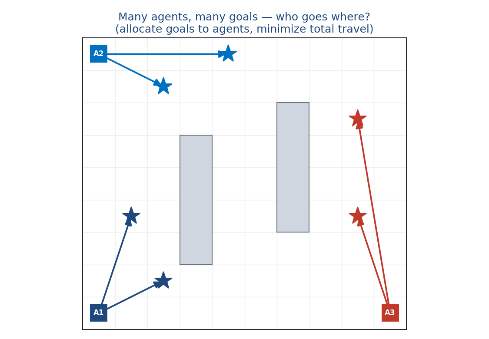

<!--
The core decision in multi-agent coordination is the ALLOCATION: which agent takes
which goals. A bad allocation wastes travel and creates collisions. Real systems
(warehouse robots, drone delivery) solve versions of this constantly and need it fast.
-->

---

## The problem (formally)

**Multi-agent goal allocation = mTSP inside MAPF**

- each goal visited once · agents take 0/1/**many** goals
- minimize **total tour cost**, then plan collision-free paths

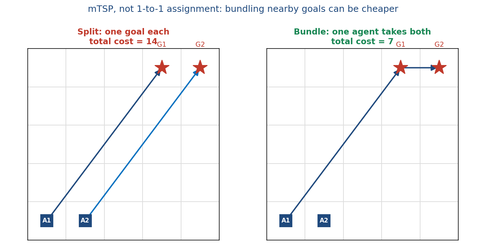

<!--
It's a multi-agent TSP, not a 1-to-1 assignment: an agent may take several goals if
cheaper — bundling two goals to one agent (cost 7) beats splitting (14). This is why the
model outputs a per-goal distribution over agents (columns sum to 1), not a permutation.
Code: model/network.py, dataset_generation/oracle.py.
-->

---

## The exact algorithm we build on

**RobustMCPF** — the optimal solver

- **LKH-TSP** allocation (k-best)  →  **CBS** collision-free planning  →  optimal paths

exact / near-optimal, but the TSP allocation is combinatorial

<!--
Ground truth = RobustMCPF in BasicMAPF mode. LKH finds the optimal allocation/tours, CBS
turns them into collision-free paths. Quality is great; the allocation step is the
combinatorial, badly-scaling part. Code: solver_wrapper.py → RobustMCPF/.
-->

---

## The bottleneck — and our idea

- **LKH allocation** cost grows with problem size; **CBS** is needed by both
- **Idea:** replace *only* the allocation with a neural net (near-instant after training)

**What we expected:** imitate the solver's allocations + a big speedup, especially at scale.

<!--
We swap the expensive combinatorial allocator for a learned one and keep everything else.
Hypothesis going in: close to solver quality, large speedup as N,M grow. (Spoiler: the
speed win is real but concentrated at scale.)
-->

---

## Where the NN drops in

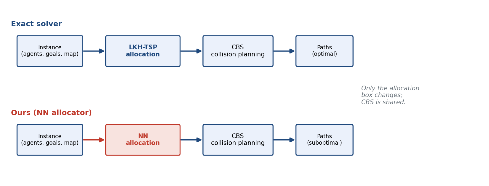

only the allocation box changes — CBS is shared (apples-to-apples)

<!--
Both pipelines share goal-ordering + CBS; only the allocator differs, so any cost/speed
difference is attributable to the allocation. Code: evaluation/full_pipeline_eval.py runs
both on identical instances/seed.
-->

---

## How we represent the problem

**Two distance matrices** (normalized BFS, walls respected)

- **D** (N×M): agent → goal   ·   **G** (M×M): goal → goal
- *distances, not coordinates*

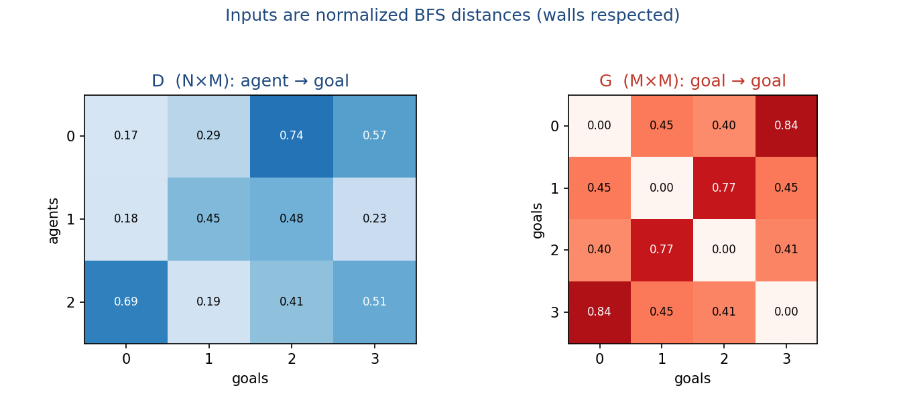

<!--
Distances determine tour cost and transfer across maps. G is the KEY feature — it encodes
which goals are near each other (which to bundle); adding G lifted accuracy +14–18 points,
more than any architecture/size/data change. Code: dataset_generation/distance.py.
-->

---

## The network

**A universal transformer**

- **row attention** (agent ↔ its goals) · **column attention** (goal ↔ its agents)
- **column softmax** output · loss = **CE + λ·MinSum**

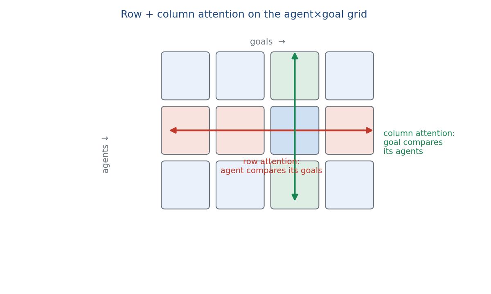

<!--
Each agent-goal pair is embedded; stacked row/column attention captures the combinatorial
structure. Output is a per-goal distribution over agents (columns sum to 1). Trained with
cross-entropy to imitate the solver + a small MinSum term (λ=0.1). Code: model/network.py,
model/losses.py.
-->

---

## One model for ANY N, M

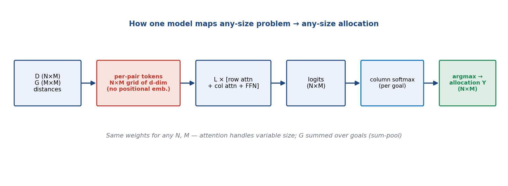

no positional embeddings → the same weights run a 2×2 or a 50×100 problem

<!--
KEY technical slide. Every scalar D[i,j] → a d-dim token (N×M grid). G is injected per goal
by embedding each G[j,k] and SUMMING over k (sum-pool → any M). No agent/goal positional
embeddings (they're unordered; attention handles variable length). Output: Linear(d→1) →
N×M logits → column softmax → argmax per goal = the binary allocation matrix.
Code: model/network.py GoalAllocTransformerUniversal.forward; decode in evaluation/evaluate.py.
-->

---

## Small vs. big model

**Two sizes, same recipe**

- h128/L6 = **1.2M** params   ·   h256/L8 = **6.3M**

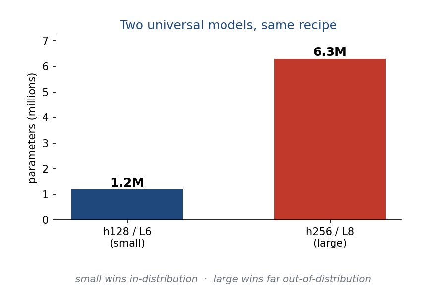

preview: small wins in-distribution, big wins far out-of-distribution

<!--
Identical except width/depth. In-distribution the small model is better and faster (big
overfits, Exp 12); at extreme extrapolation the big one generalizes better (Exp 15). We'll
see both.
-->

---

## Method

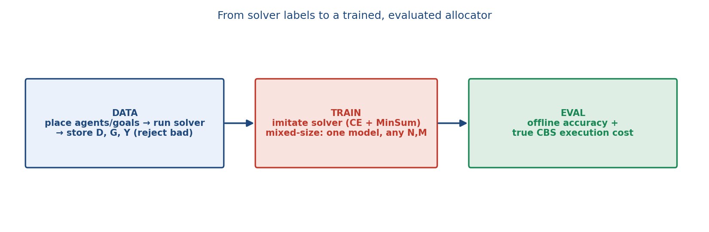

- **offline** = does the NN pick the solver's agent?   ·   **execution cost** = true CBS path length

<!--
Generate instances, run the solver, store D, G and the optimal allocation Y (reject
unreachable/over-budget). Train one universal model on many (N,M) shapes. Evaluate offline
(accuracy) and — what matters — true execution cost (NN→ordering→CBS vs solver). A pytest
suite guards it. Code: build_dataset.py, oracle.py, train.py, evaluate.py,
full_pipeline_eval.py, tests/.
-->

---

## Results: near the solver, cheaper to run

- execution-cost ratio **~1.02–1.05** · high exact-cost match · **0% infeasible**
- speedup: a few × single-instance, **~10³×** batched (allocation-only)

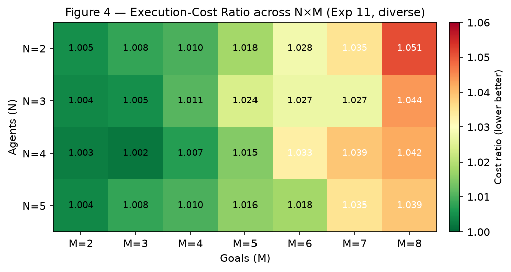

<!--
Across 28 small configs the NN is ~1–6% above optimal; the large diverse model hits mean
1.020. Most disagreements are cost-equivalent ties (exact-cost match ≫ exact-allocation
match). CBS dominates full-pipeline time, so single-instance speedup is modest; batched
allocation-only it's ~1000×. Code: Exp 9–11, RESULTS.md.
-->

---

## From random grids to real benchmark maps

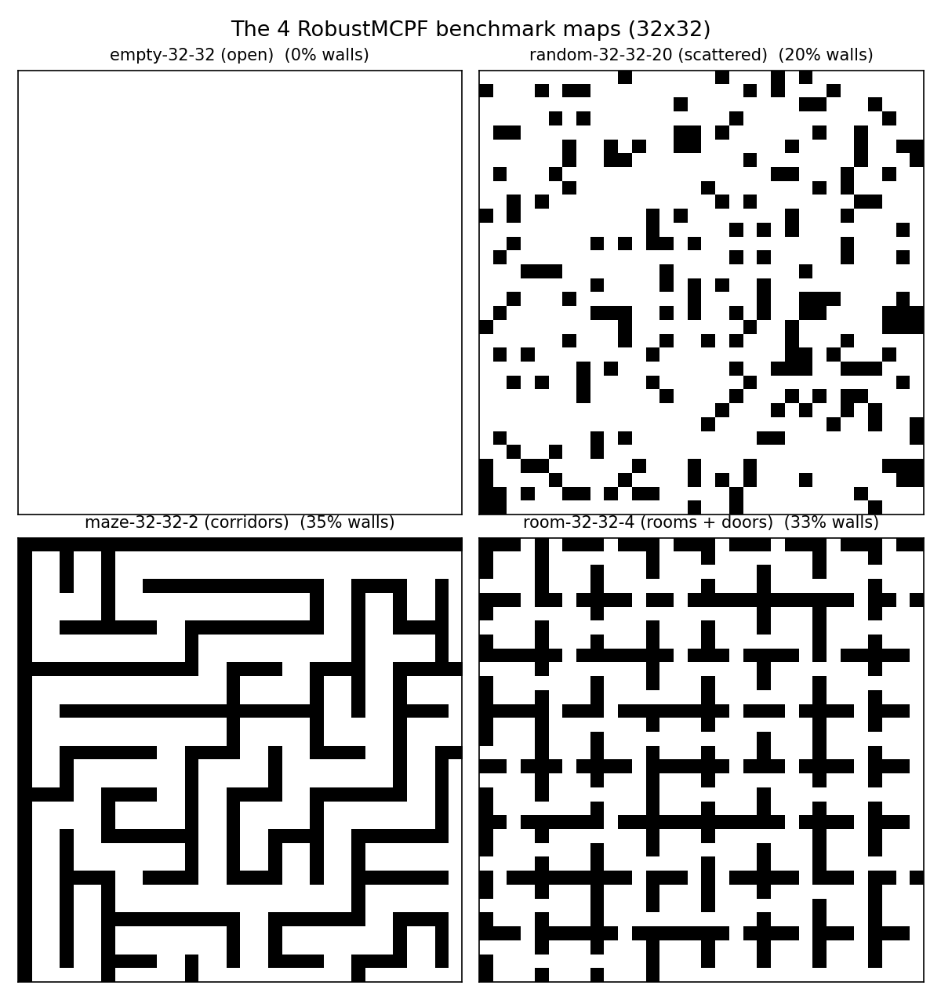

open → scattered → maze → rooms; only maze/room are truly *structured*

<!--
The 4 standard RobustMCPF benchmark maps. Only maze and room carry corridor/room structure
— that distinction drives the next results.
-->

---

## Results: generalization studies

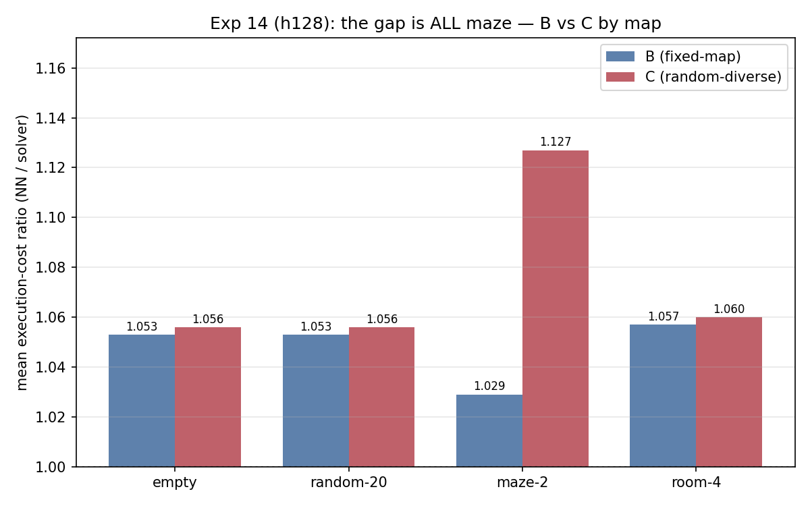

- transfers across **geometry**, not **scale** · random≈fixed training **except the maze** · XL: **5.9–9.4×**

<!--
(a) The small model zero-shot on real maps at small N/M = 1.019, but at large N/M fails
(1.246 vs map-trained 1.048); scissors at M=30 — more agents hurt the old model (1.28→1.44),
help the in-range one (1.10→1.05): generalizes across map SHAPE, not problem SCALE.
(b) random-grid training ties fixed-map everywhere except the maze (1.029 vs 1.127): random
walls never make corridors. (c) at N≤50/M≤100 the big model extrapolates best (1.208 vs 1.244),
speedup 5.9–9.4×. Code: Exp 13.b/14/15 in RESULTS.md.
-->

---

## When to use the NN vs. the exact solver

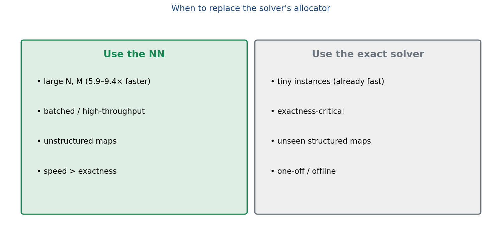

<!--
The NN replaces only allocation, so it wins where allocation/TSP cost dominates and many
instances are solved: big problems (5.9–9.4× at ~20% overhead), batched inference (orders of
magnitude), unstructured maps (cheap random training transfers). The exact solver still wins
on tiny instances (already ms-fast), exactness-critical settings, and unseen structured maps.
-->

---

## Demo: same instance, solver vs NN

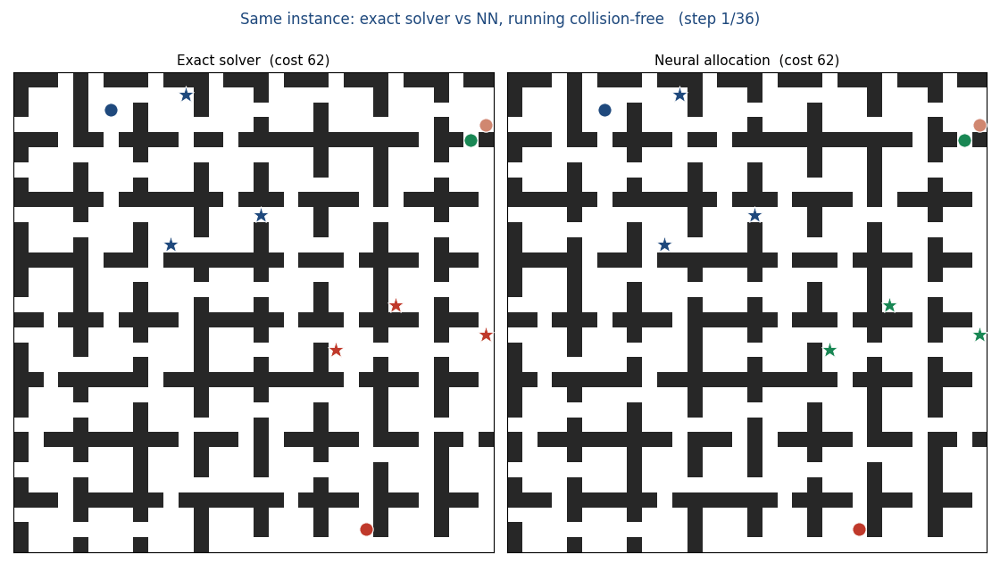

different allocation, **identical cost (62)** — the NN found its own equally-optimal plan

<!--
Real run of model A on the room map. Both pipelines reach cost 62, but the NN sends the two
right-side goals to a different agent than the solver — CBS executes it collision-free at the
same cost. A vivid example of the cost-equivalent ties behind the high exact-match rates.
(GIF animates in HTML/Marp preview; PDF shows a frame — fallback assets/demo_final_frame.png.)
Regenerate: presentation/make_demo.py.
-->

---

## Conclusion

- **Problem:** optimal allocation (mTSP in MAPF) — but the combinatorial step scales badly
- **Idea:** a small universal transformer imitates it from distances — **near-optimal**
- **Generalizes:** any N,M; across scale and (with the right data) geometry
- **Payoff:** **5.9–9.4×** at scale, within ~20% of optimal — use it where speed/scale matter

next: tour-aware loss · learned goal-ordering head

<!--
Recap the 4 messages. Future work: bring the solver's true tour cost into the loss, and
replace brute-force goal ordering with a learned head.
-->

---

## Thank you — questions?

repo: Neural_MCPF_Allocation · RobustMCPF (LKH + CBS)

<!-- Keep the backup slides (O1–O7) ready for likely questions. -->

---
<!-- ============================ OPTIONAL / BACKUP ============================ -->

## (Backup) Loss

$$\mathcal{L} = \mathcal{L}_{CE} + \lambda\,\mathcal{L}_{MinSum},\quad \lambda=0.1$$

- **CE** — per-goal cross-entropy vs the solver (imitation)
- **MinSum** = Σ P·D — mild geometric regularizer

<!-- CE drives imitation; MinSum prevents degenerate uniform predictions early. Code: model/losses.py. -->

---

## (Backup) Full results — heatmaps

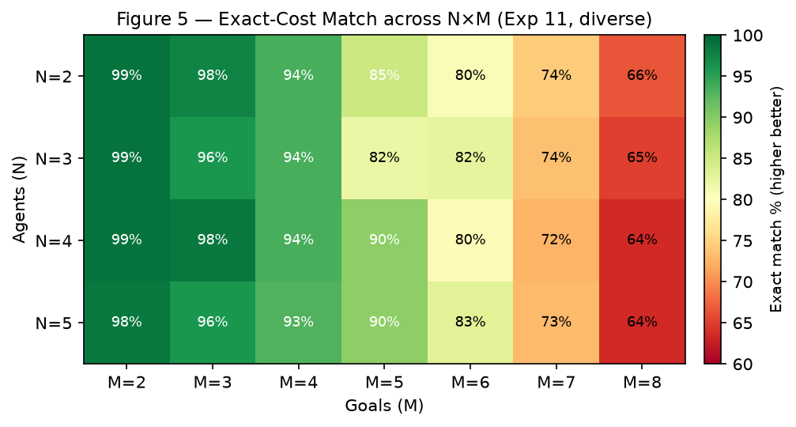

<!-- Difficulty gradient is horizontal — driven by M (goals), nearly flat in N. Worst cell still within ~5%. -->

---

## (Backup) Overfitting & small-vs-big

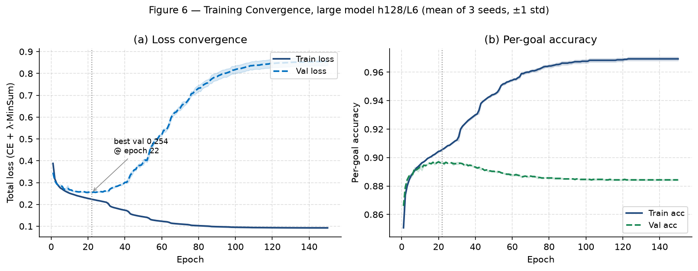

<!--
Val loss bottoms ~epoch 22 then rises; best-val-loss checkpointing = effective early
stopping. Explains why the big model overfits in-distribution but generalizes better far-OOD.
-->

---

## (Backup) Why random training fails on the maze

<!--
Random Bernoulli walls ≈ empty/random/room statistically, but never produce long corridors →
the random-trained model never learned to thread them; the entire fixed-vs-random gap is the
maze (worst cell maze n5m30: 1.075 vs 1.362).
-->

---

## (Backup) Metrics

- **Offline** — allocation agreement (per-goal / full-assignment accuracy)
- **Execution cost** — true CBS path-length ratio (NN / solver)
- **Exact match** — identical integer cost (≫ exact-allocation match → ties)

<!-- Code: evaluation/evaluate.py (offline), full_pipeline_eval.py (execution cost). -->

---

## (Backup) Limitations & next steps

- brute-force goal ordering is O(k!) — mitigated by a nearest-neighbor + 2-opt fallback
- CBS execution cost is **not differentiable**
- next: **tour-aware loss** · **learned goal-ordering head**

<!-- Code: full_pipeline_eval.order_goals. These are the levers to push quality + remove the last classical bottleneck. -->
