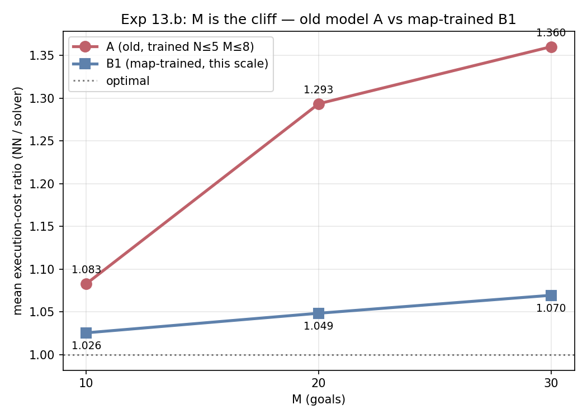
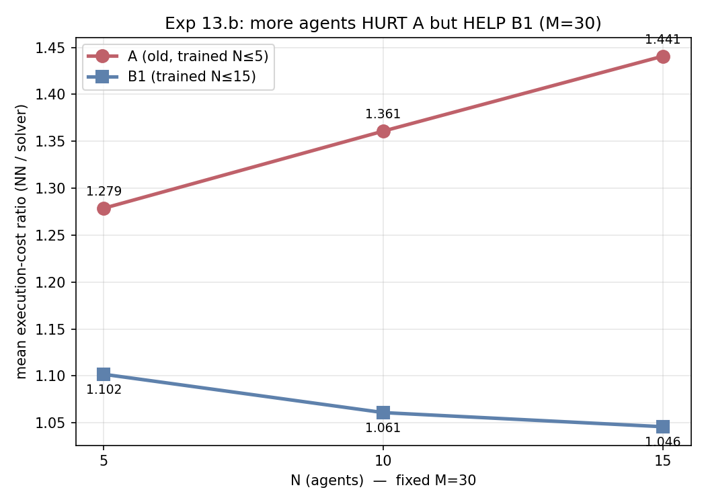
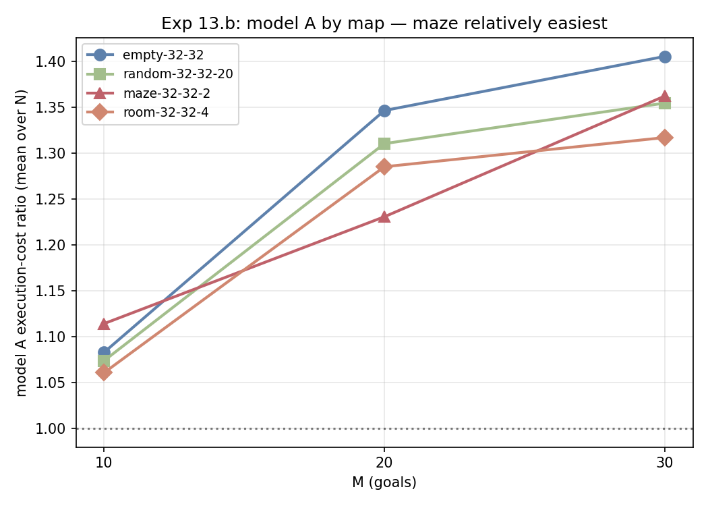

# Exp 13.b — Old model at large N/M on real maps (A vs B1)

**Date:** 2026-06-18
**Question:** Does the old model A — a universal h128/L6 transformer trained only on small random
grids (8–12, walls 0.1–0.5, N≤5 × M≤8) — extrapolate *upward* in agent/goal count to the paper-scale
regime (N∈{5,10,15} × M∈{10,20,30}) on the 4 real benchmark maps? Or do we genuinely need to retrain
at that scale (model B1)?

**Setup.** Model A = release `exp11-model` (`checkpoints/large_s0/best.pt`). Evaluated on the 4 small
RobustMCPF maps (empty, random-20, maze, room; all 32×32) at all 36 (map, N, M) configs, 200
instances/config. Offline metrics via `evaluate.py` (200 pre-generated test instances/config,
`data/paper_maps_local/`); true execution cost via `full_pipeline_eval.py --map_file`
(`--n_instances 200 --seed 987654321 --instance_timeout 600`) — **same seed/instances as B1's
Exp 12 run**, so the A-vs-B1 comparison is on identical problems. B1 = `paper_current_s0`, the
same-architecture (h128/L6) model trained *on the 4 maps* at this N/M scale.

## Verdict

**Model A does NOT extrapolate to large M. Retraining at scale (B1) is justified.** Mean execution
cost ratio over 36 configs: **A = 1.246 vs B1 = 1.048**. The gap is small at M=10 and blows up with M,
and — unlike B1 — A gets *worse* as more agents are added.

## Offline allocation accuracy (model A) — per-goal (full-assignment in parens)

| map \ cfg | n5m10 | n5m20 | n5m30 | n10m10 | n10m20 | n10m30 | n15m10 | n15m20 | n15m30 |
|-----------|-------|-------|-------|--------|--------|--------|--------|--------|--------|
| empty | .77 (.22) | .52 (.00) | .41 (.00) | .79 (.23) | .48 (.00) | .41 (.00) | .79 (.12) | .47 (.00) | .38 (.00) |
| random-20 | .82 (.32) | .52 (.00) | .47 (.00) | .81 (.24) | .50 (.00) | .43 (.00) | .77 (.17) | .48 (.00) | .41 (.00) |
| maze | .84 (.35) | .70 (.04) | .66 (.01) | .82 (.26) | .72 (.01) | .65 (.00) | .80 (.21) | .74 (.01) | .69 (.00) |
| room | .84 (.36) | .57 (.00) | .50 (.00) | .84 (.29) | .54 (.00) | .49 (.00) | .80 (.16) | .54 (.00) | .50 (.00) |

vs its home turf (Exp 13.a, small N/M: per-goal 0.88–0.98). Per-goal falls to ~0.5 at M=20 and ~0.4
at M=30 on open/random/room; maze holds best (0.65–0.74). Full-assignment ≈ 0 for M≥20 is expected
(0.5²⁰ ≈ 0) and not the operative metric — execution cost is.

## Execution-cost ratio (NN/solver), per config

| map \ cfg | n5m10 | n5m20 | n5m30 | n10m10 | n10m20 | n10m30 | n15m10 | n15m20 | n15m30 |
|-----------|-------|-------|-------|--------|--------|--------|--------|--------|--------|
| empty | 1.089 | 1.248 | 1.283 | 1.072 | 1.343 | 1.411 | 1.088 | 1.449 | 1.524 |
| random-20 | 1.074 | 1.233 | 1.273 | 1.065 | 1.326 | 1.356 | 1.083 | 1.373 | 1.436 |
| maze | 1.090 | 1.223 | 1.312 | 1.111 | 1.256 | 1.354 | 1.142 | 1.214 | 1.421 |
| room | 1.062 | 1.232 | 1.247 | 1.054 | 1.284 | 1.322 | 1.065 | 1.340 | 1.383 |

(n15m30 random/room and maze n10m30 completed 198–199/200; the rest 200/200 — no meaningful skips.)

## A vs B1

**By M** (mean over 4 maps × 3 N):

| M | A | B1 | A − B1 |
|---|-----|-----|--------|
| 10 | 1.083 | 1.026 | +0.057 |
| 20 | 1.293 | 1.049 | +0.245 |
| 30 | 1.360 | 1.070 | +0.291 |

**By N at M=30** (mean over 4 maps) — the divergence:

| N | A | B1 |
|---|-----|-----|
| 5 | 1.279 | 1.102 |
| 10 | 1.361 | 1.061 |
| 15 | 1.441 | 1.046 |

## Figures

The M cliff (mean over 4 maps × 3 N) — A blows up with M, B1 stays flat:

The scissors: at fixed M=30, more agents **hurt** A but **help** B1:

Model A by map — maze relatively easiest (walls inflate the optimum):

## Findings

1. **M is the cliff.** At M=10 model A is still serviceable (mean 1.083, within ~5–14% of optimal);
   at M=20 it jumps to 1.293 and at M=30 to 1.360. It was trained at M≤8, and the goal-count
   extrapolation is what breaks it.
2. **The "near-tie" property breaks at large M.** In Exp 13.a (small N/M) model A's disagreements
   with the solver were cost-equivalent ties (ratio ~1.02 despite imperfect accuracy). At M≥20 that
   no longer holds — ratio 1.25–1.52 means the mis-allocations are genuinely expensive, not ties.
3. **More agents *hurt* model A but *help* B1 (opposite trends).** At M=30, A degrades as N grows
   (1.279 → 1.441) while B1 improves (1.102 → 1.046). B1, trained on N up to 15, exploits extra
   agents to spread goals into shorter tours; A, trained on N≤5, mis-coordinates beyond its range —
   so adding agents adds error. This is the clearest signal that scale-extrapolation, not just map
   geometry, is the limiter.
4. **Maze remains relatively easiest by ratio** (walls inflate the optimum, shrinking the relative
   gap) — consistent with Exp 13.a — but even maze reaches 1.42 at n15m30.

## Conclusion

The old model A is a strong allocator only near its training scale. It transfers across *map
geometry* (Exp 13.a: clean generalization to real maps at small N/M) but **not across N/M scale**:
at the paper-scale regime its execution cost is ~25% above optimal on average and up to 52% worse on
the hardest cell, versus ~5% for the same-architecture map-trained B1. Retraining at the target N/M
scale (B1, and the upcoming random-trained C1/C2) is necessary; the old model cannot be reused as-is
for the large-N/M problem. The one bright spot is M=10, where A stays within ~5–14% of optimal —
useful if only goal counts ≤10 are ever needed.

## Reproduce

- Offline: `results/oldmodel_real_maps_offline.txt`; full-pipeline CSVs: `results/fullpipe_oldmodel/*.csv`
- Data: `data/paper_maps_local/<map>/n{N}m{M}/test/` · Logs: `logs/gen_13b.log`, `logs/fullpipe_13b.log`
- B1 numbers: RESULTS.md Exp 12 (h128/L6 per-config table). (`results/`, `data/`, `logs/` git-ignored.)
