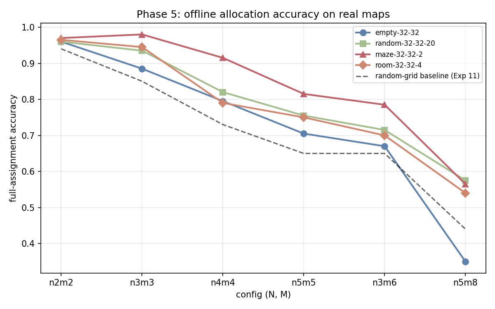
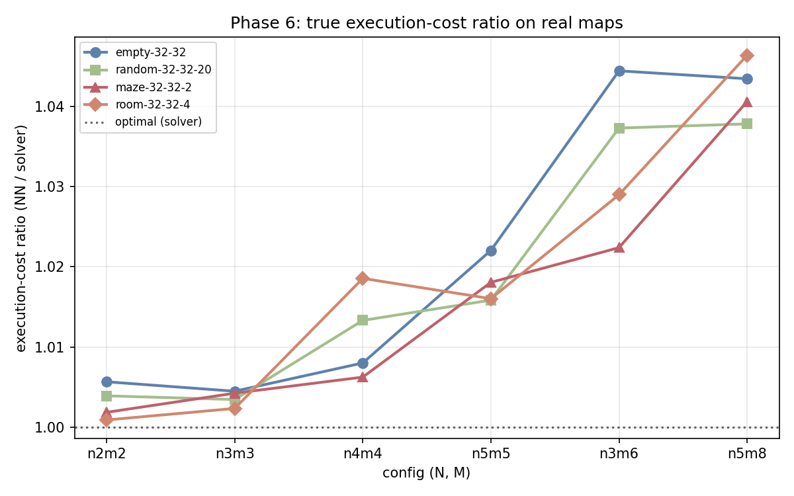
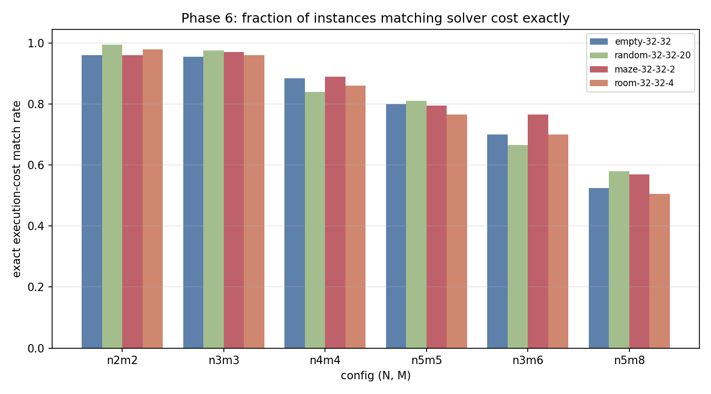
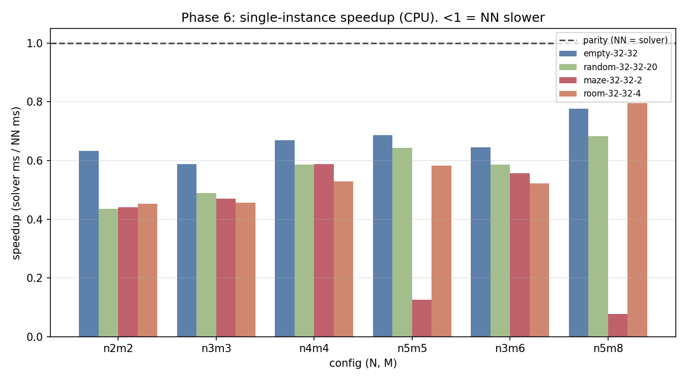
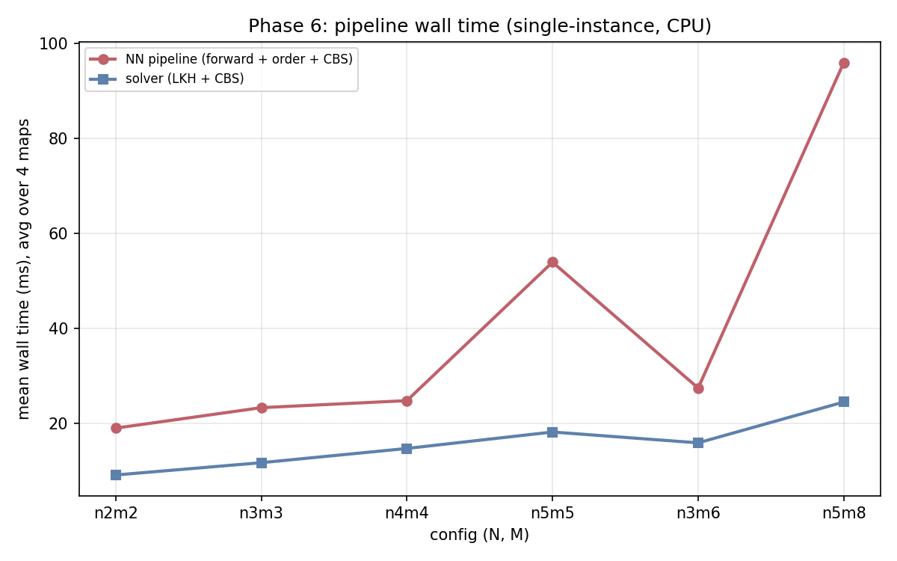

# Old Model on Real Benchmark Maps — Full Evaluation Report

**Date:** 2026-06-17
**Author:** Ofek (eval branch `Ofek-real-maps-few-agent/goals-old-model`)

## Summary

The Exp 11 universal transformer (`large_s0`, h128/L6, ~1.2M params), trained only on small
random-obstacle grids (8–12, walls 0.1–0.5, N∈{2,3,4,5}×M∈{2..8}), was evaluated **zero-shot** on
the four 32×32 RobustMCPF benchmark maps (`empty-32-32`, `random-32-32-20`, `maze-32-32-2`,
`room-32-32-4`) at six configs spanning easy→hard (n2m2, n3m3, n4m4, n5m5, n3m6, n5m8),
200 instances each.

**Two headline results:**
1. **Allocation quality transfers cleanly.** Offline accuracy matches or beats the random-grid
   training baseline on every map; true execution cost is within **1.9% of optimal on average**
   (mean ratio 1.019), 0% infeasible. Structured maps (maze, room) are *easier* than the open grid.
2. **The NN is not faster on these maps — because there are no collisions to skip.** Single-instance
   CPU speedup averages **0.5× (NN ~2× slower)**. The cause is **collision density**, not N/M or
   hardware: on roomy 32×32 maps the solver resolves 0 conflicts and never re-roots (k=1), so its
   CBS is trivial and there is nothing for the NN to save. Exp 9–11's 1.7–4× speedup came from
   crowded 8×8 grids where the NN skipped the solver's expensive collision-resolution work. The
   speed case for the NN returns at higher density / larger TSPs (Phase 7), not this regime.

---

## Setup

| Item | Value |
|------|-------|
| Model | Exp 11 `large_s0`, transformer h128/L6, `use_goal_dists`, universal. From GitHub release `exp11-model`. |
| Maps | 4 × 32×32 RobustMCPF benchmarks (open / 20%-random / maze / rooms). |
| Configs | n2m2, n3m3, n4m4, n5m5, n3m6, n5m8 (200 instances each, seed 987654321). |
| Ground truth | RobustMCPF BasicMAPF solver (LKH + CBS). |
| Hardware | Local CPU (WSL2), torch 2.12 CPU build, single-instance (no batching). |

Two evaluations:
- **Phase 5 (offline):** NN allocation vs solver allocation — per-goal / full-assignment accuracy.
- **Phase 6 (full pipeline):** NN forward → goal ordering → CBS, vs full solver (LKH + CBS),
  comparing **true collision-free execution cost** and wall time on fresh instances.

---

## Phase 5 — Offline allocation accuracy

Full-assignment accuracy (per-goal in parens). Dashed line = Exp 11 random-grid baseline.

| Config | empty | random-20 | maze | room | baseline |
|--------|-------|-----------|------|------|----------|
| n2m2 | .960 (.978) | .960 (.973) | .970 (.983) | .965 (.983) | .94 |
| n3m3 | .885 (.952) | .935 (.968) | **.980 (.993)** | .945 (.977) | .85 |
| n4m4 | .795 (.934) | .820 (.943) | **.915 (.965)** | .790 (.924) | .73 |
| n5m5 | .705 (.902) | .755 (.919) | **.815 (.946)** | .750 (.932) | .65 |
| n3m6 | .670 (.904) | .715 (.917) | **.785 (.937)** | .700 (.903) | .65 |
| n5m8 | **.350** (.836) | .575 (.882) | .565 (.898) | .540 (.879) | .44 |

**Findings.**
- **No generalization collapse** — every map matches or beats the training baseline.
- **Structured maps are easier.** Walls/corridors disambiguate allocation (they break the ties an
  open grid leaves to chance) and make the goal-goal distance feature `G` more informative. Maze is
  the best map at every config.
- **The open grid is the weak case** — empty-32-32 at n5m8 (.350) is the only cell below baseline:
  wide-open geometry + 8 goals = maximum tie ambiguity.
- **M is the difficulty axis, N barely matters** (consistent with Exp 7–11).

---

## Phase 6 — True execution cost & speed

### Execution-cost ratio (NN / solver)

All maps stay within **1.00–1.05** of optimal, rising gently with M. Mean over 24 configs **1.019**.
Crucially, this holds *even where Phase-5 assignment accuracy was 50–60%* (n5m8): most "wrong"
allocations are cost-equivalent ties, so the real path cost barely moves. **0% infeasible, 0%
fallbacks** across all 4800 instances.

### Exact execution-cost match rate

Far higher than exact-assignment match — e.g. n2m2/n3m3 match the solver's cost exactly 95–99% of
the time, confirming near-ties dominate the disagreements.

### Speed: NN pipeline vs solver

**Every bar is below parity — the NN pipeline is ~2× slower at this scale (mean speedup 0.5×).**
This contradicts Exp 9–11's 1.7–4× full-pipeline speedup — yet those ran on the *same N/M range*.
The difference is **not** scale or hardware. It is **collision density**, and the per-instance
counters prove it:

> Across all 24 configs: **mean solver conflicts = 0.00, mean solver k-roots = 1.00.** On these
> roomy 32×32 maps the solver never resolves a collision and never re-roots.

**Why the speedup vanished.** The NN's speed advantage comes from skipping the solver's
*collision-resolution* work, not its allocation:

| | Exp 9–11 (8×8, 64 cells) | here (32×32, 1024 cells) |
|---|---|---|
| Agent density (same N) | high → **collisions** | ~16× lower → **~0 collisions** |
| CBS | resolves many conflicts | trivial, first try |
| Solver k-best re-rooting | re-roots (k>1) on conflict | never (k=1) |
| **Solver wall time** | **expensive (31–65 ms)** | **cheap (9–29 ms)** |
| What the NN skips | LKH **+ repeated CBS / re-rooting** | only a cheap LKH |

On 8×8 the solver burns time fighting collisions (repeated CBS passes + k-best escalation); the NN
fixes one allocation and runs CBS once, skipping all of it → 2–4× faster. On 32×32 there are no
collisions, so the solver's CBS is trivial and it never re-roots — `cheap LKH + one trivial CBS`
leaves almost nothing for the NN to save, while the NN still pays its forward pass + an O(k!)
goal-ordering step. **In one line: on roomy maps there is no collision work to skip.**

Secondary effects: (a) the **O(k!) brute-force goal ordering** blows up when one agent collects many
goals — maze n5m5 (127 ms) and **n5m8 (283 ms)** are single agents ordering 6–8 goals (classical-
algorithm cost, not the model — the NN forward is sub-millisecond); (b) **CPU, single-instance** is
the NN's worst case (no GPU, no batching).

**Implication.** Re-running on the cluster hardware would *not* flip this — the cause is algorithmic
(zero collisions → cheap solver), not CPU/GPU speed. The speedup should return at higher N/M
density (e.g. N∈{10,15} on 32×32), which restores *both* levers: collisions → expensive solver CBS,
and large TSPs → expensive LKH. That is the regime to re-time in Phase 7.

### Phase 6 aggregate table

| map | cfg | cost ratio | exact match | mean diff (steps) | NN ms | solver ms | speedup |
|-----|-----|-----------|-------------|-------------------|-------|-----------|---------|
| empty | n2m2 | 1.006 | 96.0% | 0.18 | 14.2 | 9.0 | 0.6× |
| empty | n3m3 | 1.004 | 95.5% | 0.15 | 23.5 | 13.8 | 0.6× |
| empty | n4m4 | 1.008 | 88.5% | 0.33 | 25.5 | 17.1 | 0.7× |
| empty | n5m5 | 1.022 | 80.0% | 0.97 | 31.9 | 21.9 | 0.7× |
| empty | n3m6 | 1.044 | 70.0% | 2.58 | 29.0 | 18.7 | 0.6× |
| empty | n5m8 | 1.043 | 52.5% | 2.60 | 37.0 | 28.8 | 0.8× |
| random-20 | n2m2 | 1.004 | 99.5% | 0.14 | 19.4 | 8.4 | 0.4× |
| random-20 | n3m3 | 1.003 | 97.5% | 0.17 | 23.1 | 11.3 | 0.5× |
| random-20 | n4m4 | 1.013 | 84.0% | 0.65 | 24.5 | 14.4 | 0.6× |
| random-20 | n5m5 | 1.016 | 81.0% | 0.78 | 28.7 | 18.5 | 0.6× |
| random-20 | n3m6 | 1.037 | 66.5% | 2.44 | 26.9 | 15.8 | 0.6× |
| random-20 | n5m8 | 1.038 | 58.0% | 2.58 | 35.0 | 23.9 | 0.7× |
| maze | n2m2 | 1.002 | 96.0% | 0.23 | 20.7 | 9.1 | 0.4× |
| maze | n3m3 | 1.004 | 97.0% | 0.44 | 22.7 | 10.7 | 0.5× |
| maze | n4m4 | 1.006 | 89.0% | 0.59 | 22.3 | 13.1 | 0.6× |
| maze | n5m5 | 1.018 | 79.5% | 1.67 | 127.4 | 16.0 | 0.1× |
| maze | n3m6 | 1.022 | 76.5% | 2.72 | 25.6 | 14.2 | 0.6× |
| maze | n5m8 | 1.041 | 57.0% | 5.16 | 282.7 | 21.9 | 0.1× |
| room | n2m2 | 1.001 | 98.0% | 0.03 | 21.4 | 9.7 | 0.5× |
| room | n3m3 | 1.002 | 96.0% | 0.10 | 23.7 | 10.8 | 0.5× |
| room | n4m4 | 1.019 | 86.0% | 1.03 | 26.6 | 14.0 | 0.5× |
| room | n5m5 | 1.016 | 76.5% | 0.82 | 27.6 | 16.1 | 0.6× |
| room | n3m6 | 1.029 | 70.0% | 2.17 | 28.0 | 14.6 | 0.5× |
| room | n5m8 | 1.046 | 50.5% | 3.65 | 29.2 | 23.2 | 0.8× |
| **mean** | | **1.019** | **80.9%** | | | | **0.5×** |

---

## Conclusions

1. **The old model is a strong allocator on real maps** — within ~2% of optimal execution cost,
   never infeasible, and *better* on structured maps than on its random-grid training data. It
   generalizes on geometry (32×32, walls) and is a viable drop-in allocator at small N/M.
2. **It is not a speedup on these maps — there are no collisions to skip.** The solver resolves 0
   conflicts and never re-roots (k=1) on roomy 32×32 grids, so its work reduces to a cheap LKH +
   trivial CBS; the NN's forward + O(k!) ordering then costs more than it saves (~2× slower). This
   is algorithmic, not hardware — re-running on the cluster would not change it. Two ways to recover
   the speed advantage: (a) replace brute-force goal ordering with a cheap heuristic, and (b) test
   where the solver actually works hard — higher agent density (collisions) and/or larger TSPs.
3. **Next:** evaluate the old model on the coworker's large-N/M data (N∈{5,10,15}×M∈{10,20,30}) to
   (a) find the accuracy crossover that justifies the new (h256/L8) model, and (b) re-time the
   pipeline there, where higher density brings back collision-resolution work *and* LKH grows — the
   regime where the NN should finally pull ahead.

## Reproduce

- Figures: `.venv/bin/python evaluation/plot_real_maps.py` → `report/real_maps/`
- Phase 5 raw: `results/offline_real_maps.txt` · Phase 6 raw: `results/fullpipe_real_maps/*.csv`
- Logs: `logs/gen_eval_real_maps.log`, `logs/fullpipe_real_maps.log`
- Data: `data/paper_maps/<map>/n{N}m{M}/test/` · Plan: `docs/superpowers/plans/2026-06-17-real-maps-eval.md`
- (`results/`, `logs/`, `data/` are git-ignored.)
